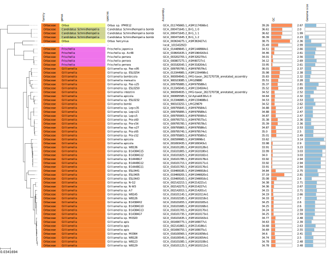

# taxonomy workflow

Build a phylogeny with FastTree based on a concatenated alignment of 103 marker genes identified with checkM.
Can include local fasta files as well as genomes downloaded from the NCBI with Assembly Finder (https://github.com/metagenlab/assembly_finder).

## input

See templates folder

- config file
- assembly finder table
- local genome(s) table

# execution

```
snakemake --snakefile ~/work/dev/metagenlab/bact_taxonomy/Snakefile --configfile config.yaml --use-conda --conda-prefix ~/miniconda3/ --use-singularity --singularity-prefix /data/snakemake_singularity_amplicons/ --cores 20 plots/phylo.svg
```

# example output figure: phylogeny of the family Orbaceae

